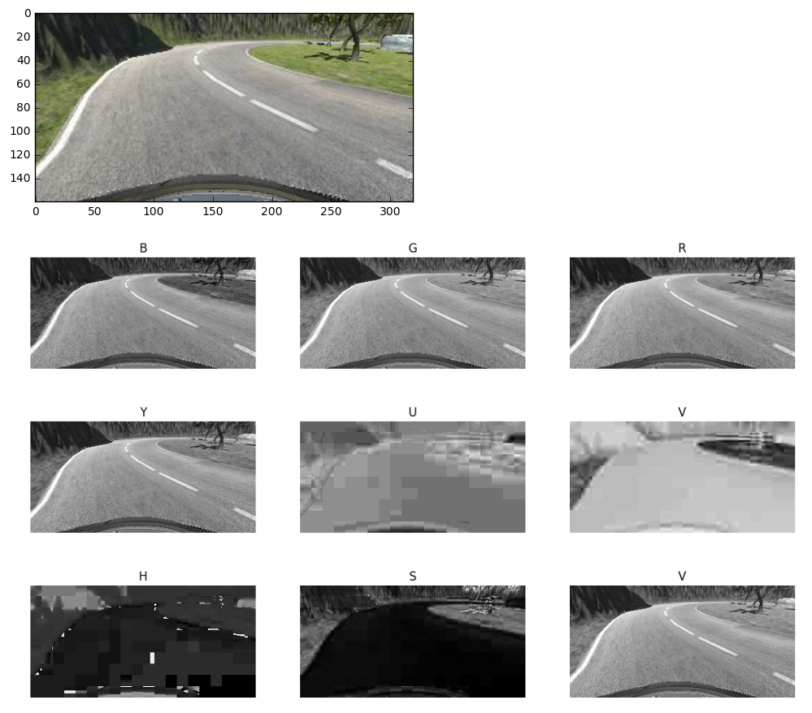
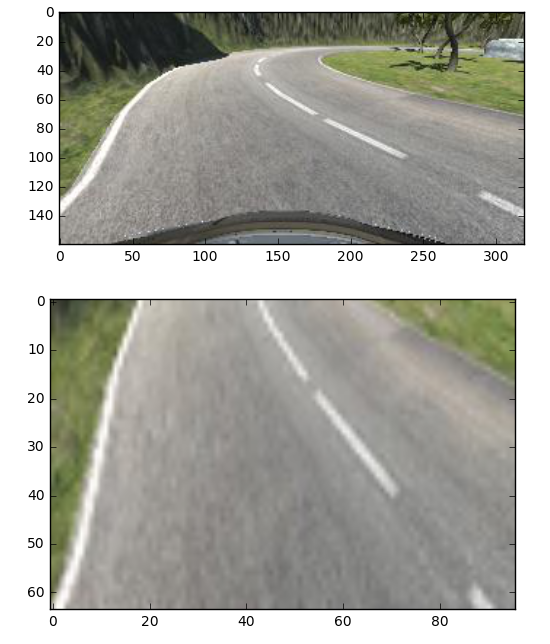
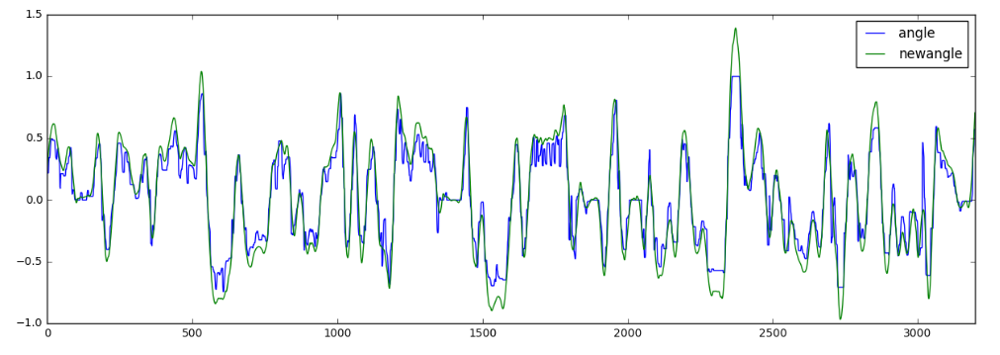

# **Behavioral Cloning** 

## Writeup Template

### This document is the writeup of the Project "Behavioral Cloning".  It explains the process for developing a keras/tensorflow based model to stear an autonomouse car simulator across 2 tracks

[](http://www.youtube.com/watch?v=_sS6V2vSLGw)


---

**Behavioral Cloning Project**

The goals / steps of this project are the following:
* Use the simulator to collect data of good driving behavior
* Build, a convolution neural network in Keras that predicts steering angles from images
* Train and validate the model with a training and validation set
* Test that the model successfully drives around track one without leaving the road
* Summarize the results with a written report


[//]: # (Image References)

[image_model]: ./wrapupdata/model_layers.png "Model Layers"
[image_loss]: ./wrapupdata/training_validation_loss.png "Training/Validation loss"
[image3]: ./examples/placeholder_small.png "Recovery Image"
[image4]: ./examples/placeholder_small.png "Recovery Image"
[image5]: ./examples/placeholder_small.png "Recovery Image"
[image6]: ./examples/placeholder_small.png "Normal Image"
[image7]: ./examples/placeholder_small.png "Flipped Image"

## Rubric Points
### Here I will consider the [rubric points](https://review.udacity.com/#!/rubrics/432/view) individually and describe how I addressed each point in my implementation.  


---
### Files Submitted & Code Quality

#### 1. Submission includes all required files and can be used to run the simulator in autonomous mode

My project includes the following files:
* model.py containing the script to create and train the model
* drive.py for driving the car in autonomous mode
* model.h5 containing a trained convolution neural network 
* data_utils.py containing data functions used in drive.py and model.py
* image_utils.py containing image related functions used in drive.py and model.py
* writeup_report.md summarizing the results
* /videos folder contains mp4 videos

Data training files are not included in the github repository.

#### 2. Submission includes functional code
Using the Udacity provided simulator and my drive.py file, the car can be driven autonomously around the track by executing 
```sh
python drive.py model.h5
```

#### 3. Submission code is usable and readable

The model.py file contains the code for training and saving the convolution neural network. The file shows the pipeline I used for training and validating the model, and it contains comments to explain how the code works.

### Model Architecture and Training Strategy

#### 1. Model Architecture

Model used is a variation of the NVIDIA model from following paper:

[NVIDIA - End to End Learning for Self-Driving Cars](https://images.nvidia.com/content/tegra/automotive/images/2016/solutions/pdf/end-to-end-dl-using-px.pdf)

However several chnages have been implemented to improve final results for this specific use case.
The following graph details the different layers of the model.

![Model][image_model]

The model consists on a convolutional neural network moving the original 3 filter depths corresponding to the RGB image planes up to a final 64 filter depth layer.

After the convolutional layers a series of 3 fully connected layers move to final 1 neuron layer.

RELU activation layers are used to introduce nonlinearity and we have included 2 Dropouts and 1 Pooling layer in the model.

An initial normalization layer using lambda is also used at the begining in the model.

I have tried to keep the model small enough to reduce degrees of freedom and specially to improve training times.  The final model has 77,569 trainable parameters.

Below the output sample from the Keras summary.

```sh
Layer (type)                     Output Shape          Param #     Connected to
====================================================================================================
lambda_1 (Lambda)                (None, 64, 96, 3)     0           lambda_input_1[0][0]
____________________________________________________________________________________________________
convolution2d_1 (Convolution2D)  (None, 61, 93, 12)    588         lambda_1[0][0]
____________________________________________________________________________________________________
maxpooling2d_1 (MaxPooling2D)    (None, 30, 46, 12)    0           convolution2d_1[0][0]
____________________________________________________________________________________________________
convolution2d_2 (Convolution2D)  (None, 14, 22, 24)    4632        maxpooling2d_1[0][0]
____________________________________________________________________________________________________
convolution2d_3 (Convolution2D)  (None, 6, 10, 36)     13860       convolution2d_2[0][0]
____________________________________________________________________________________________________
dropout_1 (Dropout)              (None, 6, 10, 36)     0           convolution2d_3[0][0]
____________________________________________________________________________________________________
convolution2d_4 (Convolution2D)  (None, 2, 4, 64)      36928       dropout_1[0][0]
____________________________________________________________________________________________________
flatten_1 (Flatten)              (None, 512)           0           convolution2d_4[0][0]
____________________________________________________________________________________________________
dense_1 (Dense)                  (None, 40)            20520       flatten_1[0][0]
____________________________________________________________________________________________________
activation_1 (Activation)        (None, 40)            0           dense_1[0][0]
____________________________________________________________________________________________________
dropout_2 (Dropout)              (None, 40)            0           activation_1[0][0]
____________________________________________________________________________________________________
dense_2 (Dense)                  (None, 20)            820         dropout_2[0][0]
____________________________________________________________________________________________________
activation_2 (Activation)        (None, 20)            0           dense_2[0][0]
____________________________________________________________________________________________________
dense_3 (Dense)                  (None, 10)            210         activation_2[0][0]
____________________________________________________________________________________________________
activation_3 (Activation)        (None, 10)            0           dense_3[0][0]
____________________________________________________________________________________________________
dense_4 (Dense)                  (None, 1)             11          activation_3[0][0]
====================================================================================================
Total params: 77,569
Trainable params: 77,569

```

#### 2. Attempts to reduce overfitting in the model

Model contains different layers to reduce the overfitting.
- Max Pooling Layer. With a 2x2 filter it reduces the number of plane sizes by half.  This reduces the degree of freedom of the network and increases training times.
- Dropout Layer.  After 3rd convolutional layer a Dropout layer is introduced.  Purpose is to reduce overfitting.
- Dropout Layer. After activation of first fully connected layer a second dropout layer to reduce overfitting is included.

The model was trained and validated from different sets.  This sets correspond to one lap recordings on the different tracks.
Each track recording is stored in specific subfolders in main ./data folder.  **Training data used is NOT included**

Many different track trainings were initially created, both tracks, in both directions, mouse and keyboard used, special recoveries, etc.
At the end we just used following training sets:
- data_track_2_right_1:  Driving in 2nd track on right side - Direction default - Input Mouse
- data_2: Driving in track 1 - Direction default - Input Mouse

For validation we used same tracks but different laps recorded.
To have better estimations we did not ramdonly splitted the original data in training and validation as many similar image sequences and steering angle values would end up in both sets, so we created new recorded laps for the validation.


#### 3. Model parameter tuning

Many different model variations were done and different parameters for the model tested.
Both the final MSE (mean squared error) values for validation and empiric results in the automous driving test were done to select final model structures and parameters.

The model used an adam optimizer and loss function based on mean squared error.  

Based on final validation/training loss plot the number of epochs should be around 5, but we choosed to go up to 10 (maybe adding some overfitting)

![Training Validation Loss][image_loss]

Finally a dropout of 30% of neurons on both dropout layers is used.  This ensures sufficient reduction in overfitting.


```sh 
# Line 104 in process.py
epochs = 10
batch_size = 256  
learing_rate = 0.001
dropout = 0.3
```


#### 4. Creation of the Training Set & Training Process

Different recorded laps on both tracks were done, generating many different subsets of recorded data.

| Subfolder         	|     Track	        					| 
|:---------------------:|:---------------------------------------------:| 
| data_1         	| Track 1 - Direction Normal - Input Keyboard  		| 
| data_2    	    | Track 1 - Direction Normal - Input Mouse  	    |
| data_3			| Track 2 - Direction Normal - Input Keyboard		|
| data_4	      	| Track 2 - Direction Normal - Input Mouse  		|
| data_5    	    | Track 1 - Direction Normal - Input Mouse	        |
| data_rec_1_1			| Track 1 - **Recoveries** - Input Mouse 		|
| data_track_2_right_1    	    | Track 2 - Direction Normal, right side - Input Keyboard	|
| data_track_slow_1_1			| Track 1 - Direction Normal - Input Mouse	|
| data_track_slow_1_rev_1       | Track 1 - Direction Reverse - Input Mouse |
| data_track_slow_2_1			| Track 2 - Direction Normal - Input Mouse	|
| data_track_slow_2_rev_1		| Track 2 - Direction Reverse - Input Mouse	|

These different conbinations included recoveries were used during training and validations and finally the datasets with better MSE values and empirical autonomouse driving results were used.

For training, we used one lap per each circuit.
Training: 
- data_track_2_right_1
- data_2
Validation
- data_4
- data_5

No need for data_rec_1_1 (recoveries) as final behaviour was very robust already.

The implementation made very easy to just switch and try different recorded laps. Just by including in each list the name of the subfolders where data was stored.

In process.py lines 99 and 100 we create a lists of the different data subfolders and we just include those subfolders we may want to use in training and validation
```sh
# Line 109 process.py
data_training_groups = ['data_track_2_right_1', 'data_2']
data_validation_groups = ['data_5', 'data_4']
``` 

#### 5. Data Image Preprocessing ####

I tried different type of preprocessing steps in check the training/validation loss as well as final behaviour of the autonomouse car.

The first step was to decide about the input image color space channgels to feed the model pipeline.
I tried 3 different possibilities:
- BGR - Blue, Green, Red channgels
- YUV - Luma and chrominance components
- HSV - Hue Saturation Value components.

From the images below HSV, specially S component looked a good candidate initally due to how well it defined the road area, 



Unfortunately shadows in the road were not well tracked by model using HSV components as input. 
We also tested with YUV compoents as in NVIDIA paper but at the end the best performance was obtained with RGB values.

Next step was to crop and transform the input image.  Initially the cropping was done inside the model but after some tries I decided to crop outside the model in the preprocessing phase together with the resizing of the image.  It led to better final results and simplified building the transformation pipeline with all steps included in one preprocessing function.

Transformation is done by:
- Crop from row 50 to 130
- Resize final image to 64 pixels height x 96 pixels width.
- In Keras model - Normalization

Se below example.



Reducing image size was due to increase training speeds and didn't have any noticeable effect on final results.

#### 6. Data Angles preprocessing - Smoothing ####

We started feeding the model with direct angle values without any change from the data file. 
Angles captured had lots of dependance on the input used to drive the car during data capturing. 
When using keyboard the angle distribution was not smooth and when using the mouse the values contained lots of steering corrections.

Those steering corrections done i.e. to adjust the steering within a curve **created many outliers** in the data and decreasing the model capabilities.
We used an smooth interpolation of the angles and multiplied them by a 1.3 factor to increase a bit the steering capabilities of the model. 
This helped a lot to add smooth autonomous driving by the model.



In above picture we can see in green the new smoothed angles multiplied by the 1.3 factor.

Smoothing is done in data_utils.py using following function.

```python
dfn['angle'] = 1.3*scipy.signal.savgol_filter(df.angle,window_length=41,polyorder=2)
```

Savitzky-Golay filter is used to smoothing the data without distoring the signal by using a convolution process.


#### 6. Data Augmentation ####

As Neural Networks needs lots of data to be properly trained we need to ensure to create new samples out of existing data.
The simulator is already a good tool to generate new data easily and many training sets were created in order for testing and validating the models.

These training sets took into account driving in different directions in same circuit, with different driving behaviors and styles, input modes, speeds, recovery actions, etc.
As part of the exercise I tried to keep minimum the amount of final training sets and stick to just one lap per circuit. Any additional data should be created by using some kind of data augmentation.

The final data created followed these steps:
- Use center camera and preprocessed angle.
- Use left camera and angle increased by 30% - To simulate recovery from left side.
- Use right camera and angle decreased by 30% - To simulate recovery from right side.
- Flip above 3 images vertically and inverse angle.

So from each frame we obtain a total of 6 final frames.

Other techniques were initially applied like obscuring the image, or add other color spaces on top of the RGB ones supplied, but none of them had a big improvement and made training step slower.

#### 7. Videos of Autonomous driving in emulator ####

The target was to able to achieve circuit 2 in right side of lane autonomous driving and it was achieve perfect.

**Click image below video to see Project video**

[](http://www.youtube.com/watch?v=_sS6V2vSLGw)

Files:

* [Download Edited Video](./videos/Self_Driving_Car_Project.mp4)
* [Download Circuit 1 Video](./videos/run_lap2.mp4)
* [Download Circuit 2 Video](./videos/run_lap2.mp4)

